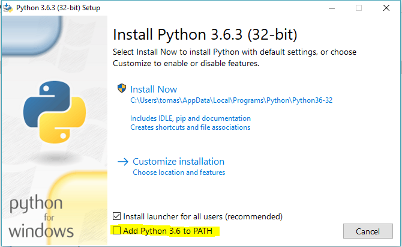

Co to jest Python
-----------------

> Python - język programowania wysokiego poziomu ogólnego przeznaczenia, o rozbudowanym pakiecie bibliotek standardowych, którego ideą przewodnią jest czytelność i klarowność kodu źródłowego. Jego składnia cechuje się przejrzystością i zwięzłością.
>
> Python wspiera różne paradygmaty programowania: obiektowy, imperatywny oraz w mniejszym stopniu funkcyjny. Posiada w pełni dynamiczny system typów i automatyczne zarządzanie pamięcią, będąc w tym podobnym do języków Perl, Ruby, Scheme czy Tcl. Podobnie jak inne języki dynamiczne jest często używany jako język skryptowy. Interpretery Pythona są dostępne na wiele systemów operacyjnych.
>
> Python rozwijany jest jako projekt Open Source zarządzany przez Python Software Foundation, która jest organizacją non-profit.

Fragment pochodzi z serwisu
[Wikipedia](https://pl.wikipedia.org/wiki/Python).

Historia Pythona
----------------

> Pythona stworzył we wczesnych latach 90. Guido van Rossum - jako następcę języka ABC, stworzonego w Centrum voor Wiskunde en Informatica (CWI – Centrum Matematyki i Informatyki w Amsterdamie). Van Rossum jest głównym twórcą Pythona, choć spory wkład w jego rozwój pochodzi od innych osób. Z racji kluczowej roli, jaką van Rossum pełni przy podejmowaniu ważnych decyzji projektowych, często określa się go przydomkiem "Benevolent Dictator for Life" (BDFL).
>
> Nazwa języka nie pochodzi od zwierzęcia, jak można przypuszczać. Python pochodzi od serialu komediowego emitowanego w latach siedemdziesiątych przez BBC. Ten serial nosi nazwę "Monty Python's Flying Circus" (Latający Cyrk Monty Pythona). Projektant potrzebował nazwy, która była krótka, unikalna i nieco tajemnicza. Na dodatek był fanem serialu, więc uważał, że taka nazwa dla języka była świetna.
>
> Wersja 1.2 była ostatnią wydaną przez CWI. Od 1995 roku Van Rossum kontynuował pracę nad Pythonem w Corporation for National Research Initiatives (CNRI) w Reston w Wirginii, gdzie wydał kilka wersji Pythona, do 1.6 włącznie. W 2000 roku van Rossum i zespół pracujący nad rozwojem jądra Pythona przenieśli się do BeOpen.com by założyć zespół BeOpen PythonLabs. Pierwszą i jedyną wersją wydaną przez
> BeOpen.com był Python 2.0.
>
> Po wydaniu wersji 1.6 i opuszczeniu CNRI przez van Rossuma, który zajął się programowaniem komercyjnym, uznano za wysoce pożądane, by Pythona można było używać z oprogramowaniem dostępnym na licencji GPL. CNRI i Free Software Foundation (FSF) podjęły wspólny wysiłek w celu odpowiedniej modyfikacji licencji Pythona. Wersja 1.6.1 była zasadniczo identyczna z wersją 1.6, z wyjątkiem kilku drobnych poprawek oraz licencji, dzięki której późniejsze wersje mogły być zgodne z licencją GPL. Python 2.1 pochodzi zarówno od wersji 1.6.1, jak i 2.0.
>
> Po wydaniu Pythona 2.0 przez BeOpen.com Guido van Rossum i inni programiści z PythonLabs przeszli do Digital Creations. Cała własność intelektualna dodana od tego momentu, począwszy od Pythona 2.1 (wraz z wersjami alpha i beta), jest własnością Python Software Foundation (PSF), niedochodowej organizacji wzorowanej na Apache Software Foundation.

Fragment pochodzi z serwisu
[Wikipedia](https://pl.wikipedia.org/wiki/Python).

## Instalacja

Pliki instalacyjne Pythona możesz pobrać z tej strony: https://www.python.org/downloads/. Lista plików do pobrania, dla wszystkich systemów znajduje się na samym dole strony. Poniżej są szczegółowe instrukcje instalacji, w zależności od Twojego systemu operacyjnego.

#### Windows

Wybierz wersję instalacyjną (https://www.python.org/downloads/release/python-363/ sekcja Files na dole strony), odpowiednią dla Twojego systemu. 

#### Lista plików instalacyjnych dla Windows

Po pobraniu odpowiedniego pliku np. "Windows x86-64 executable installer" dla systemu 64-bitowego (lub "Windows x86 executable installer" dla 32-bitowego, numer wersji może się zmieniać), uruchom go (klikając dwukrotnie na niego) i postępuj według wyświetlanych instrukcji:



Zaznacz nastęujące opcje:

- Add Python to environment variables **WAŻNE**

Jeśli masz wszystkie opcje zaznaczone, to możesz nacisnąć przycisk Install

#### Opcje zaawansowane instalatora

Uwaga! Jeśli Twój system Windows 7 nie był aktualizowany przez dłuższy okres czasu, to możesz natrafić na błąd podczas instalacji, który będzie zawierać frazę podobną do "...C runtime libraries...". W tym wypadku uruchom instalator Python jako administrator: prawy przycisk myszy na pliku instalacyjnym -> "Uruchom jako administrator". Jeśli dalej nie będzie można dokończyć instalacji, to musisz zaktualizować swój system.

## Wprowadzenie do Pythona

### Wiersz poleceń Pythona

Aby rozpocząć zabawę z Pythonem, musisz otworzyć jego wiersz poleceń na swoim komputerze. 

Wpisz *python*, jeśli pracujesz na Windowsie, lub *python3*, jeśli pracujesz na MacOS/Linuxie. Wciśnij Enter.

```python
$ python
Python 3.6.3 (...)
Type "help", "copyright", "credits" or "license" for more information.
>>>
```
Oto Twoje pierwsze polecenie w Pythonie!

Po uruchomieniu Pythona, wiersz poleceń wygląda tak: `>>>`. Jest to sygnał, że od tego momentu można używać wyłącznie instrukcji języka Python. Nie musisz za każdym razem wpisywać `>>>` - Python zrobi to za Ciebie.

Jeśli w którymkolwiek momencie zechcesz wyjść z konsoli Pythona, po prostu wpisz polecenie `exit()` i naciśnij `enter`. Alternatywnie, możesz użyć kombinacji klawiszy:

`Ctrl + C` w Windows lub, jeśli nie zadziałało, to `Ctrl + Z` a potem `Enter` (kombinacja zależy od wersji Pythona i Windowsa), albo `Ctrl + D` w Macu/Linuksie.

Po udanym wyłączeniu konsoli Pythona, nie będziesz już więcej widzieć promptu >>> na początku nowej linii.

Teraz jednak nie chcesz wychodzić z konsoli Pythona - chcesz za jej pomocą nauczyć się czegoś nowego. Zaczniemy od czegoś bardzo prostego. Spróbuj wpisać jakieś działanie matematyczne, np. `2 + 3`, i wciśnij `Enter`.
```python
>>> 2 + 3
>>> 5
>>> 
```
Świetnie! Czy widzisz, że na ekranie pojawiła się podpowiedź? Python umie liczyć! ;) Spróbuj użyć innych poleceń takich jak: - 4 * 5 - 5 - 1 - 40 / 2

### Łańcuch znaków (ang. *String*)

A jakby tak wpisać swoje własne imię? Wpisz swoje imię, używając cudzysłowów, w ten sposób:
```python
>>> "Jan"
>>> 'Ola'
```
Właśnie patrzysz na swój pierwszy String! Jest to ciąg znaków, który może być przetwarzany przez komputer. String musi zawsze zaczynać się i kończyć tym samym znakiem. Może to być apostrof (') lub cudzysłów (") - nie ma różnicy! Sygnalizują one Pythonowi, że wszystko, co znajduje się pomiędzy nimi, jest typu String.

Łańcuchy znaków mogą być łączone. Spróbuj tak:
```python
>>> "Cześć " + "Ola"
>>> 'Cześć Ola'
```
Można również mnożyć łańcuchy znaków za pomocą liczb:
```python
>>> "Ola" * 3
>>> 'OlaOlaOla'
```
Jeśli chcesz użyć apostrofu wewnątrz łańcucha znaków, możesz to zrobić na dwa sposoby.

Umieszczając string w cudzysłowie (dzięki temu apostrof wewnątrz stringu nie zostanie potraktowany jako znak kończący string):
```python
>>> "Runnin' down the hill"
```
lub poprzedzając apostrof odwróconym ukośnikiem (\'):
```python
>>> 'Runnin\' down the hill'
```
Analogicznie, jeśli chcesz użyć cudzysłowu wewnątrz stringu, możesz to zrobić albo poprzez ograniczenie całego stringu parą apostrofów:
```python
>>> 'Co dziś oglądamy? "Żywot Briana" czy "Sens życia"?'
```
albo, pozostawić string w cudzysłowie, ale te wewnętrzne poprzedzić odwróconym ukośnikiem:
```python
>>> "Co dziś oglądamy? \"Żywot Briana\" czy \"Sens życia\"?"
```
Fajnie, co? Możesz także wyświetlić swoje imię wielkimi literami. Wpisz po prostu:
```python
>>> "Ola".upper()
>>> 'OLA'
```
Funkcja (na przykład taka jak `upper()` powyżej) jest zestawem poleceń, które Python musi wykonać na danym obiekcie ("Ola") gdy tylko ją wywołasz.

A chcesz sprawdzić z ilu liter składa się Twoje imię to również możesz skorzystać z funkcji!
```python
>>> len("Ola")
>>> 3
```
Zastanawiasz się, dlaczego czasami wywołujemy funkcję z `.` (kropką) na końcu łańcucha znaków (jak tutaj: "Ola".upper()), a czasami najpierw wywołujemy funkcję, a dopiero potem umieszczamy string w nawiasach? Jest tak dlatego, że w niektórych przypadkach funkcje są związane z obiektami. Tak jak `upper()`, która może być użyta wyłącznie na stringach. Taką funkcję nazywamy wówczas <u>metodą</u>. Są również funkcje, które nie są powiązane z niczym konkretnym i mogą być używane na różnych typach obiektów, jak na przykład `len()`. Dlatego przekazujemy "Ola" jako parametr dla funkcji `len()`.

### Podsumowanie podrozdziału

- wiersz poleceń - wpisywanie instrukcji (kodu) w wierszu poleceń Pythona powoduje wyświetlenie odpowiedzi przez Pythona,

- liczby i łańcuchy znaków - Python używa liczb w działaniach matematycznych oraz łańcuchów znaków dla obiektów tekstowych,
- operatory - jak `+ `czy `*`, które tworzą nową wartość z tych już istniejących,
- funkcje - jak `upper()` czy `len()`, służą do wykonywania działań na obiektach.

Są to podstawy każdego języka programowania, które musimy zawsze znać. 

### Błędy

Czy możemy sprawdzić długość liczby w taki sam sposób jak długość naszego imienia? Wpisz len(304023) i wciśnij Enter:
```python
>>> len(304023)
>>> Traceback (most recent call last):
>>>   File "<stdin>", line 1, in <module>
>>> TypeError: object of type 'int' has no len()
```
To był błąd! Komunikat mówi nam, że obiekty typu `int` (liczby całkowite, *ang. integer*) nie mają długości. Zatem co możemy zrobić? Może da się przekształcić liczbę jako string? Stringi mają ustaloną długość, zgadza się?
```python
>>> len(str(304023))
>>> 6
```
Działa! Powyżej została użyta funkcja `str()` wewnątrz funkcji `len()`. Funkcja `str()` konwertuje wszystko do postaci łańcuchów znaków. Funkcja `len()` dzięki temu otrzymała jako parametr tekst **'304023'** a nie liczbę.

- Funkcja `str()` przekształca wartości na stringi

- Funkcja `int()` przekształca wartości na liczby

<u>Ważne</u>: każdą liczbę można przekonwertować do postaci tekstowej, ale na odwrót - tekst na liczbę - już niekoniecznie, bo przecież jaki miałby być wynik polecenia *int('cześć')*? (Zadziała natomiast polecenie *int('42')*)

### Zmienne

Ważnym zagadnieniem w programowaniu są zmienne. Zmienna to nic innego jak nazwa nadana jakiejś wartości, którą potem możemy się posługiwać. Programiści używają zmiennych do przechowywania danych, dzięki czemu ich kod jest bardziej czytelny i nie muszą każdorazowo zastanawiać się, co jest czym.

Przypuśćmy, że trzeba stworzyć nową zmienną zwaną imie:
```python
>>> imie = "Ola"
```
Po prostu: "imie" równa się Ola.

Jak jwidać powyżej, program nie wyświetlił niczego, w przeciwieństwie do tego jak to robił wcześniej. Zatem skąd wiadomo, że zmienna faktycznie istnieje? Po prostu wpisz imie i wciśnij Enter:
```python
>>> imie
>>> 'Ola'
```
Twoja pierwsza zmienna :) Zawsze masz możliwość zmiany tego, do czego ta zmienna się odnosi:
```python
>>> imie = "Jan"
>>> imie
>>> 'Jan'
```
Mozesz także używać jej w funkcjach:
```python
>>> len(imie)
>>> 5
```
Ekstra, co? Oczywiście zmienne mogą reprezentować cokolwiek, także liczby! Spróbuj tak:
```python
>>> a = 4
>>> b = 6
>>> a * b
>>> 24
```
Ale co by było, gdyby użyto złej nazwy? Masz pomysł, co mogłoby się stać? Sprawdźmy!
```python
>>> miasto = "Tokyo"
>>> masto
>>> Traceback (most recent call last):
>>>   File "<stdin>", line 1, in <module>
>>> NameError: name 'masto' is not defined
```
Błąd! Jak widzisz, Python obsługuje rodzaje błędów, a ten nosi nazwę *NameError*. Python zwróci taki błąd, gdy będziesz próbować użyć nazwy, która nie została jeszcze utworzona. Gdy w przyszłości natrafisz na ten rodzaj błędu, poszukaj w swoim kodzie literówek w nazwach zmiennych.

Poświęć chwilę czasu na zabawę i przekonaj się, co możesz z tym zrobić!

#### Funkcja print

Spróbuj wpisać następujący kod:
```python
>>> imie = 'Maria'
>>> imie
>>> 'Maria'
>>> print(imie)
>>> Maria
```
Kiedy wpisujesz po prostu imie, interpreter Pythona zwraca odwzorowanie stringu będącego wartością zmiennej 'imie', czyli litery M-a-r-i-a zamknięte w pojedynczym cudzysłowie ''. Natomiast gdy napiszesz print(imie), Python wypisze zawartość zmiennej na ekran, bez żadnego cudzysłowu, co wygląda lepiej.

Jak się później przekonasz, `print()` jest szczególnie użyteczny, gdy potrzeba wypisać coś z wnętrza funkcji, lub gdy trzeba wypisać wartości w kilku wierszach.

### Listy

Oprócz łańcuchów znaków i liczb całkowitych, Python dysponuje bogactwem różnych typów obiektowych. Teraz zapoznasz się z typem zwanym listą. Listy są dokładnie tym, co myślisz: obiektami, które są listami innych obiektów :)

Stwórzmy listę:
```python
>>> []
>>> []
```
Tak, lista jest pusta. Jest to niespecjalnie przydatne. Może listę numerów totolotka? Nie ma sensu powtarzać się za każdym razem, więc tutaj również zostanie użyta zmienna:
```python
>>> wyniki = [3, 42, 12, 19, 30, 59]
```
Dobrze, jest lista! Co można z nią zrobić? Zobaczmy ile liczb znajduje się w tej liście. Masz pomysł, jakiej funkcji należy użyć? Była wykorzystana we wcześniejszych przykładach!
```python
>>> len(wyniki)
>>> 6
```
Tak! len() może zwrócić Ci liczbę obiektów zawartych w liście. Prawda że przydatne? To może teraz posortujmy listę:
```python
>>> wyniki.sort()
```
Polecenie to niczego nie zwraca, po prostu zmieniło kolejność liczb zawartych w liście. Wypisz jej zawartość jeszcze raz i zobacz co się stało:
```python
>>> print(wyniki)
>>> [3, 12, 19, 30, 42, 59]
```
Jak widzisz, liczby na liście są teraz uporządkowane według wartości od najniższej do najwyższej.

A gdyby tak odwrócić kolejność?
```python
>>> wyniki.reverse()
>>> print(wyniki)
>>> [59, 42, 30, 19, 12, 3]
```
Proste, prawda? Jeśli chcesz dodać coś do swojej listy, możesz to zrobić wpisując polecenie:
```python
>>> wyniki.append(199)
>>> print(wyniki)
>>> [59, 42, 30, 19, 12, 3, 199]
```
Jeśli chcesz wyświetlić tylko pierwszą liczbę, możesz to wykonać używając indeksów. *Indeks* jest numerem mówiącym nam, w którym miejscu listy znajduje się dany element. Programiści zaczynają liczenie od zera, zatem pierwszy element listy znajduje się w miejscu oznaczonym indeksem 0, następny z indeksem 1, i tak dalej. Wpisz następujący kod:
```python
>>> print(wyniki[0])
>>> 59
>>> print(wyniki[1])
>>> 42
```
Jak widzisz, możesz uzyskać dostęp do każdego z elementów listy za pomocą jej nazwy oraz numeru indeksu wewnątrz nawiasów kwadratowych.

Aby skasować element listy, musisz użyć indeksów, które już znasz oraz polecenia `pop()`. Zobacz jak to działa na przykładzie - usuń pierwszy element z listy.
```python
>>> print(wyniki)
>>> [59, 42, 30, 19, 12, 3, 199]
>>> print(wyniki[0])
>>> 59
>>> wyniki.pop(0)
>>> print(wyniki)
>>> [42, 30, 19, 12, 3, 199]
```
Wszystko zadziałało zgodnie z planem!

Żeby było zabawniej, sprawdź inne indeksy: 6, 7, 1000, -1, -6 czy -1000. Sprawdż, czy jesteś w stanie przewidzieć rezultat przed użyciem instrukcji. Czy otrzymane rezultaty mają sens?

Wykaz wszystkich metod dostępnych dla list znajdziesz w odpowiednim rozdziale dokumentacji Pythona: https://docs.python.org/3/tutorial/datastructures.html

### Słowniki

Słownik przypomina nieco listę, jednak różni się tym, że dostęp do wartości uzyskuje się za pomocą klucza, a nie indeksu. Kluczem może być dowolny ciąg znaków lub liczba. Pusty słownik tworzymy tak:
```python
>>> {}
>>> {}
```
A teraz spróbuj wpisać poniższą instrukcję (spróbuj użyć własnych danych):
```python
>>> student = {'imie' : 'Ola', 'kraj' : 'Polska', 'ulubione_liczby' : [7, 42, 92]}
```
Za pomocą tej instrukcji została utworzona właśnie zmienna o nazwie *student* zawierającą trzy pary klucz-wartość:

- klucz imie wskazuje na wartość 'Ola' (obiekt typu string),
- kraj wskazuje na wartość 'Polska' (kolejny string),
- zaś ulubione_liczby odnoszą się do [7, 42, 92] (obiekt typu list zawierający trzy liczby).

Za pomocą poniższej składni możesz sprawdzać wartości poszczególnych kluczy:

```python
>>> print(student['imie'])
>>> Ola
```
Widzisz, zupełnie jak w liście. Ale nie trzeba pamiętać numeru indeksu, wystarczy nazwa klucza.

A co się stanie, gdy poprosimy Pythona o wartość klucza, który nie istnieje? Masz pomysł? Spróbuj tak zrobić i zobacz efekt!
```python
>>> uczestniczka['wiek']
>>> Traceback (most recent call last):
>>>   File "<stdin>", line 1, in <module>
>>> KeyError: 'wiek'
```
Spójrz, kolejny błąd! Tym razem *KeyError*. Python próbuje Ci pomóc i wskazuje, że klucz 'wiek' nie istnieje w tym słowniku.

Kiedy powinno się użyć słownika, a kiedy listy? To bardzo dobre pytanie! Zastanów się nad rozwiązaniem, zanim spojrzysz na odpowiedź poniżej.

Potrzebujesz ułożyć elementy w określonej kolejności? Wybierz listę.
Potrzebujesz powiązać wartości z kluczami, żeby mieć później łatwiejszy dostęp do nich (używając klucza)? Użyj słownika.
Słowniki, podobnie jak listy, mogą ulegać zmianie (*ang. mutable*), co oznacza, że po ich utworzeniu można je nadal zmieniać. Możesz dodać do stworzonego już słownika nowe pary klucz-wartość, w taki sposób:

```python
>>> student['ulubiony_jezyk'] = 'Python'
```
Podobnie jak w przypadku list, metoda len() zwraca liczbę par klucz-wartość w danym słowniku. Śmiało, wpisz polecenie:
```python
>>> len(student)
>>> 4
```
Za pomocą polecenia pop() możesz usunąć element ze słownika. Założmy, że chcesz usunąć wpis oznaczony kluczem 'ulubione_liczby'. Po prostu wpisz następującą instrukcję:
```python
>>> student.pop('ulubione_liczby')
>>> student
>>> {'kraj': 'Polska', 'ulubiony_jezyk': 'Python', 'imie': 'Ola'}
```
Jak widać z wyświetlonego rezultatu, para klucz-wartość odpowiadająca kluczowi 'ulubione_liczby' została usunięta.

Ponadto możesz także zmienić wartość odpowiadającą kluczowi, który już istnieje w słowniku. Napisz:
```python
>>> student['kraj'] = 'Niemcy'
>>> student
>>> {'kraj': 'Niemcy', 'ulubiony_jezyk': 'Python', 'imie': 'Ola'}
```
Jak widać, wartość klucza *'kraj'* została zmieniona z 'Polska' na 'Niemcy'. 

### Podsumowanie podrozdziału

W tej części zawarto następujące zagadnienia:

- błędu - umiesz już czytać ze zrozumieniem błędy, pojawiające się, gdy Python nie rozumie wydanego polecenia,

- zmienne - nazwy dla obiektów, dzięki którym programuje się łatwiej, a kod jest czytelniejszy,
- listy - listy obiektów uporządkowanych w określonej kolejności,
- słowniki - zbiory obiektów przechowywanych w postaci par klucz-wartość.

### Porównywanie

Istotną częścią programowania jest porównywanie wartości, zawartości obiektów ich typów, itp. Co najłatwiej porównać? Oczywiście wartości liczbowe. Zobaczmy, jak to działa:
```python
>>> 5 > 2
>>> True
>>> 3 < 1
>>> False
>>> 5 > 2 * 2
>>> True
>>> 1 == 1
>>> True
>>> 5 != 2
>>> True
```
Pythonowi otrzymał różne liczby do porównania. Jak widać, potrafi on nie tylko porównywać liczby bezpośrednio, ale również wyniki działań na nich. 

Zastanawiasz się, dlaczego stawiamy dwa znaki równości == obok siebie, gdy sprawdzamy, czy liczby są równe? Pojedynczego znaku równości = używa się do nadawania wartości zmiennym. Zawsze, ale to zawsze musisz używać dwóch znaków równości ==, gdy chcesz sprawdzić, czy dane elementy są równe. Możesz również stwierdzić, że dwie rzeczy nie są sobie równe. Aby to zrobić, używamy symbolu !=, tak jak to zostało pokazane na przykładzie powyżej.

Użyj Pythona do wykonania dwóch innych zadań:
```python
>>> 6 >= 12 / 2
>>> True
>>> 3 <= 2
>>> False
```
Znaki >, < są zrozumiałe, ale co oznaczają >= i <=? Należy czytać je w ten sposób:

x > y oznacza: x jest większe od y
x < y oznacza: x jest mniejsze od y
x <= y oznacza: x jest mniejsze lub równe y
x >= y oznacza: x jest większe lub równe y
```python
>>> 6 > 2 and 2 < 3
>>> True
>>> 3 > 2 and 2 < 1
>>> False
>>> 3 > 2 or 2 < 1
>>> True
```
Można przekazać Pythonowi tyle liczb, ile Ci się podoba, a on zawsze zwróci Ci wynik! 

- and - gdy używasz operatora and, oba porównania muszą być prawdziwe (True), żeby całe wyrażenie było prawdziwe

- or - gdy używasz operatora or, tylko jedno z obu porównań musi być prawdziwe, aby całe wyrażenie było prawdziwe

Znasz powiedzenie "porównywać jabłka z gruszkami"? Zobacz, jak działa jego odpowiednik w Pythonie:

```python
>>> 1 > 'jabłko'
>>> Traceback (most recent call last):
>>>   File "<stdin>", line 1, in <module>
>>> TypeError: '>' not supported between instances of 'int' and 'str'
```
Widać, że podobnie jak w powiedzeniu, Python nie jest w stanie porównać liczby (int) ze stringiem (str). Zamiast tego zwraca błąd *TypeError* i informuje że te dwa typy nie mogą być porównywane ze sobą.

### Obiekt logiczny (Boolean)

Przez przypadek poznałeś nowy typ obiektu w Pythonie. Nazywa się obiektem logicznym (typ Boolean).

Są tylko dwa obiekty logiczne:

- True (prawda)

- False (fałsz)

Jednak żeby Python mógł to zrozumieć, zawsze zapisuj je tak: "True" (pierwsza litera wielka, reszta to małe litery). true, TRUE, tRUE nie zadziałają -- tylko True jest poprawne. (oczywiście to samo dotyczy pisowni "False".)

Wartości logiczne mogą także być zmiennymi! 
```python
>>> a = True
>>> a
>>> True
```
Możesz też zrobić tak:
```python
>>> a = 2 > 5
>>> a
>>> False
```
Poćwicz i pobaw się wartościami logicznymi wpisując następujące instrukcje:

True and True
False and True
True or 1 == 1
1 != 2
Wartości logiczne są jedną z najfajniejszych możliwości w programaniu.

### Zapisujemy kod programu!

Do tej pory pisałyśmy cały nasz kod Pythona w interpreterze, co zmusza nas do pisania linijka po linijce. Prawdziwe programy są zapisywane w plikach i uruchamiane przez interpreter lub kompilator naszego języka programowania. Dotąd uruchamialiśmy nasze programy w interpreterze Pythona, wprowadzając za każdym razem najwyżej jedną linijkę kodu. Ale w następnych zadaniach będziemy dodać więcej niż jeden wiersz kodu.

Aby wyjść z używanego przez nas interpretera Pythona, użyj po prostu funkcji `exit()`:
```bash
>>> exit()
>>> $
```
W ten sposób znajdziesz się z powrotem w wierszu poleceń.

Jaki edytor kodu wybraliśmy? Teraz musimy go teraz uruchomić i zapisać kod w nowym pliku:

```python
print('Coś zupełnie z innej beczki!')
```
Zauważ jedną z najfajniejszych rzeczy, jeśli chodzi o edytor kodu: kolory! Gdy pisałeś w konsoli Pythona, wszystko miało ten sam kolor. Teraz widzisz, że funkcja print() jest innego koloru niż string. Nazywa się to "podświetlanie składni" i jest naprawdę użyteczne podczas kodowania. Kolor wyrazów w edytorze będzie dla Ciebie wskazówką, np. łatwo rozpoznasz dzięki temu niezamknięty string albo literówkę w słowie kluczowym (tak jak def w funkcji). To jeden z powodów, dla których używamy edytora kodu :)

Teraz musimy zapisać plik i nadać mu wymowną nazwę. Nazwijmy go python_intro.py i zapiszmy na Pulpicie. Możemy nazwać plik jak tylko nam się podoba, ale jedna rzecz jest istotna: na końcu nazwy musi być .py. Rozszerzenie .py informuje nasz komputer, że to jest plik wykonywalny Pythona i Python może go uruchomić.

Mamy już zapisany plik, a więc czas go uruchomić! Wykorzystując wiadomości poznane w sekcji poświęconej wierszowi poleceń, użyj terminala, aby zmienić aktualny katalog na katalog Pulpitu.

W systemie Windows będzie to wyglądać tak:
```bash
> cd %HomePath%\Desktop
```
Teraz użyj Pythona do uruchomienia kodu z pliku w następujący sposób:
```bash
$ python3 python_intro.py
Coś zupełnie z innej beczki!
```
Super! Właśnie uruchomiłeś z pliku swój pierwszy program w Pythonie. 

Teraz możemy przejść do niezwykle istotnego narzędzia w programowaniu - instrukcji warunkowych

### Instrukcje warunkowe If...elif...else

Dużo różnych rzeczy w kodzie powinno być uruchamiane tylko wtedy, kiedy zostaną spełnione określone warunki. Dlatego Python posiada składnię, którą nazywamy instrukcjami warunkowymi.

Zastąp kod w pliku python_intro.py następującym:
```python
if 3 > 2:
```
Gdybyśmy to teraz zapisali i uruchomili kod, pojawił się błąd podobny do poniższego:
```bash
$ python3 python_intro.py
File "python_intro.py", line 2
         ^
SyntaxError: unexpected EOF while parsing
```
Python oczekuje od nas dalszych instrukcji, które mają zostać wykonane w przypadku, gdy warunek 3 > 2 okaże się prawdziwy (czyli przyjmie wartość True). Sprawmy, żeby Python wypisał na ekranie "To działa!". Zmień kod w pliku python_intro.py na poniższy:
```python
if 3 > 2:
    print('To działa!')
```
Zauważyłeś, że w kolejnym wierszu nasz kod posiada wcięcie 4 spacji? Musimy tak robić, aby Python wiedział, co ma uruchomić, gdy warunek jest prawdziwy. Możesz używać jednej spacji, ale prawie każdy programista Pythona stosuje 4 spacje, aby kod wyglądał czytelniej. Pojedynczy tabulator również będzie liczył się jako 4 spacje (gdy posługujemy sie edytorem, który nie automatyzuje edycji kodu języka Python, zalecane jest stosowanie 4 spcaji zamiast klawisza tab).

Zapisz plik i uruchom go jeszcze raz:
```bash
$ python3 python_intro.py
To działa!
```
A co jeśli warunek nie jest prawdziwy?

W poprzednich przykładach kod był wykonywany wtedy, gdy warunki okazywały się prawdziwe (True). Ale Python posiada również wyrażenia elif i else:
```python
if 5 > 2:
    print('5 jest jednak większe od 2')
else:
    print('5 nie jest większe od 2')
```
Po uruchomieniu wyświetli się:
```bash
$ python3 python_intro.py
5 jest jednak większe od 2
```
Gdyby 2 było większą liczbą niż 5, wtedy zostałaby wykonana druga instrukcja. Proste, nieprawdaż? Zobaczmy, jak działa `elif`:
```python
name = 'Jan'
if name == 'Ola':
    print('Hej Ola!')
elif name == 'Jan':
    print('Cześć Jan!')
else:
    print('Jeszcze się nie znamy!')
```
i uruchommy go:
```bash
$ python3 python_intro.py
Hej Jan!
```
Widzisz co się tutaj wydarzyło? `elif` pozwala Ci na dodanie dodatkowego warunku, jeśli poprzedni warunek nie został spełniony.

Po początkowej instrukcji if możesz dodać tyle instrukcji `elif` ile tylko Ci się podoba. Na przykład:
```python
glosnosc = 57
if glosnosc < 20:
    print("Prawie nic nie słychać.")
elif 20 <= glosnosc < 40:
    print("O, muzyka leci w tle.")
elif 40 <= glosnosc < 60:
    print("Idealnie, mogę usłyszeć wszystkie detale")
elif 60 <= glosnosc < 80:
    print("Dobre na imprezy")
elif 80 <= glosnosc < 100:
    print("Troszeczkę za głośno!")
else:
    print("Ojoj! Moje uszy! :(")
```
Python zbada każdy warunek i wyświetli:
```bash
$ python3 python_intro.py
Idealnie, mogę usłyszeć wszystkie detale
```
### Podsumowanie podrozdzału

W ostatnim podrozdziale nauczyłeś się:

- porównywać zawartość zmiennych, obiektów - w Pythonie do porównywania wartości możesz używać operatorów *>, >=, ==, <=, < oraz and i or*

- Boolean - typ obiektu, który może przyjmować jedną z dwóch wartości: True (prawda) lub False (fałsz)
- zapisywać pliki - przechowywać kod w plikach, co pozwala nam uruchamiać bardziej rozbudowane programy.
- if...elif...else - wyrażenia, które pozwalają Ci uruchamiać kod tylko wtedy, gdy zostaną spełnione określone warunki.

### Twoje własne funkcje!

Pamiętasz funkcje takie jak len(), które możesz uruchamiać w Pythonie? Dobra wiadomość: teraz nauczysz się pisać swoje własne funkcje!

Funkcja jest zestawem poleceń, które Python ma wykonać. Każda funkcja w Pythonie zaczyna się słowem `def`, posiada nazwę i może przyjmować parametry. Zacznijmy od prostej funkcji. Zastąp kod w pliku python_intro.py następującym:
```python
def hej():
    print('Hej!')
    print('Jak się masz?')
```
```python
hej()
```
OK, nasza pierwsza funkcja gotowa!

Być może zastanawiasz się, czemu napisałyśmy nazwę funkcji na końcu pliku. Zrobiłyśmy tak, ponieważ Python odczytuje plik i wykonuje go od góry do dołu. Zatem w celu użycia naszej funkcji, musimy ponownie wpisać ją na dole.

Uruchommy to teraz i sprawdźmy, co się stanie:
```bash
$ python3 python_intro.py
Hej!
Jak się masz?
```
Zbudujmy naszą pierwszą funkcję z parametrami. Posłużymy się wcześniejszym przykładem - funkcją, która wita każdego, kto ją uruchomi, wraz z imieniem:
```python
def hej(imie):
```
Jak widać, teraz nasza funkcja przyjmuje parametr, który nazwałyśmy imie:
```python
def hej(imie):
	if name == 'Ola':
    	print('Hej Ola!')
	elif name == 'Jan':
    	print('Cześć Jan!')
	else:
    	print('Jeszcze się nie znamy!')
```
hej()
<u>Pamiętaj</u>: Musiałyśmy dodać cztery dodatkowe spacje (razem osiem) przed funkcją `print()`, ponieważ if musi dostać informację o tym, co powinno się wydarzyć, gdy warunek zostanie spełniony. Zobaczmy teraz jak to działa:
```bash
$ python3 python_intro.py
Traceback (most recent call last):
File "python_intro.py", line 10, in <module>
  hej()
TypeError: hej() missing 1 required positional argument: 'imie'
```
Ups, błąd. Na szczęście Python zwrócił nam dość przydatny komunikat. Mówi nam, że funkcja `hej()` (ta, którą stworzyliśmy) posiada jeden wymagany argument (zwany imie) i że zapomniałyśmy go przekazać przy wywoływaniu funkcji. Naprawmy to na końcu naszego pliku:
```python
hej("Ola")
```
I wykonajmy ponownie:
```bash
$ python3 python_intro.py
Hej Ola!
```
A gdybyśmy zmieniły imię?
```python
hej("Jan")
```
I wykonajmy:
```bash
$ python3 python_intro.py
Hej Jan!
```
A jak myślisz - co się stanie, jak wprowadzimy tam inne imię (jeszcze inne niż Ola i Jan)? Spróbuj i przekonaj się, czy miałaś rację. Powinno sie wyświetlić coś takiego:
```
Jeszcze się nie znamy!
```
W ten sposób nie musisz powtarzać się za każdym razem, gdy zechcesz zmienić imię osoby, która ma zostać powitana. To właśnie dlatego funkcje są nam potrzebne - żeby nie powtarzać kodu!

Zróbmy coś sprytniejszego - istnieje znacznie więcej niż dwa imiona i raczej ciężko byłoby pisać warunek dla każdego, co?
```python
def hej(imie):
    print('Hej ' + imie + '!')
```
```python
hej("Marek")
```
Teraz wywołajmy ten kod:
```bash
$ python3 python_intro.py
Hej Marek!
```
### Pętle

Jak już wspomnieliśmy, programiści są leniwi i nie lubią się powtarzać. W programowaniu chodzi o automatyzowanie różnych rzeczy, więc nie chcemy witać ręcznie każdej osoby po imieniu, prawda? I tu właśnie przydają nam się pętle.

Pamiętasz jeszcze listy? Zróbmy listę dziewczyn:
```python
monty = ['Graham Chapman', 'Eric Idle', 'Terry Gilliam', 'Terry Jones', 'John Cleese', 'Michael Palin']
```
Chcemy przywitać każdeo aktora z naszej ulubionej grupy oddzielnie. Mamy do tego funkcję hej, zatem użyjmy jej wewnątrz pętli:
```python
for imie in monty:
```
Wyrażenie `for` zachowuje się podobnie jak `if`, a więc kod pod nimi musi być wcięty <u>4 spacjami</u>.

Oto kompletny kod, który umieścimy w pliku:
```python
def hej(imie):
    print('Hej ' + imie + '!')

monty = ['Graham Chapman', 'Eric Idle', 'Terry Gilliam', 'Terry Jones', 'John Cleese', 'Michael Palin']
for imie in monty:
    hej(imie)
    print('A teraz...')
print('A co jeszcze ma być?')
```
a gdy go uruchomimy:
```bash
$ python3 python_intro.py
Hej Graham Chapman!
A teraz...
Hej Eric Idle!
A teraz...
Hej Terry Gilliam!
A teraz...
Hej Terry Jones!
A teraz...
Hej John Cleese!
A teraz...
Hej Michael Palin!
A teraz...
A co jeszcze ma być?
```
Jak widzisz, cokolwiek umieścisz wewnątrz wyrażenia `for` wraz z wcięciem - zostanie powtórzone dla każdego elementu listy monty.

Możesz także użyć for na liczbach, używając funkcji `range()`:
```python
for i in range(1, 6):
    print(i)
```
Co wypisze nam na ekranie:
```bash
1
2
3
4
5
```
`range()` jest funkcją, która tworzy listę liczb jedna po drugiej (liczby te podajesz jako parametry).

Zwróć uwagę, że druga z tych liczb nie jest częścią listy stworzonej przez Pythona (to znaczy, że range(1, 6) liczy od 1 do 5, ale nie zawiera liczby 6). Dzieje się tak, bo "range" ma przedział jednostronnie otwarty, co oznacza, że zawiera pierwszą wartość z przedziału, ale nie zawiera ostatniej.